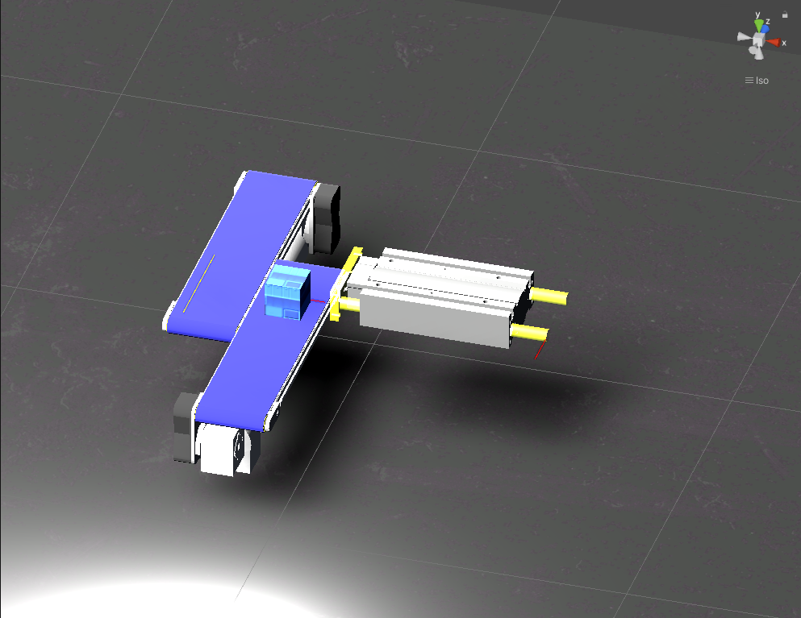
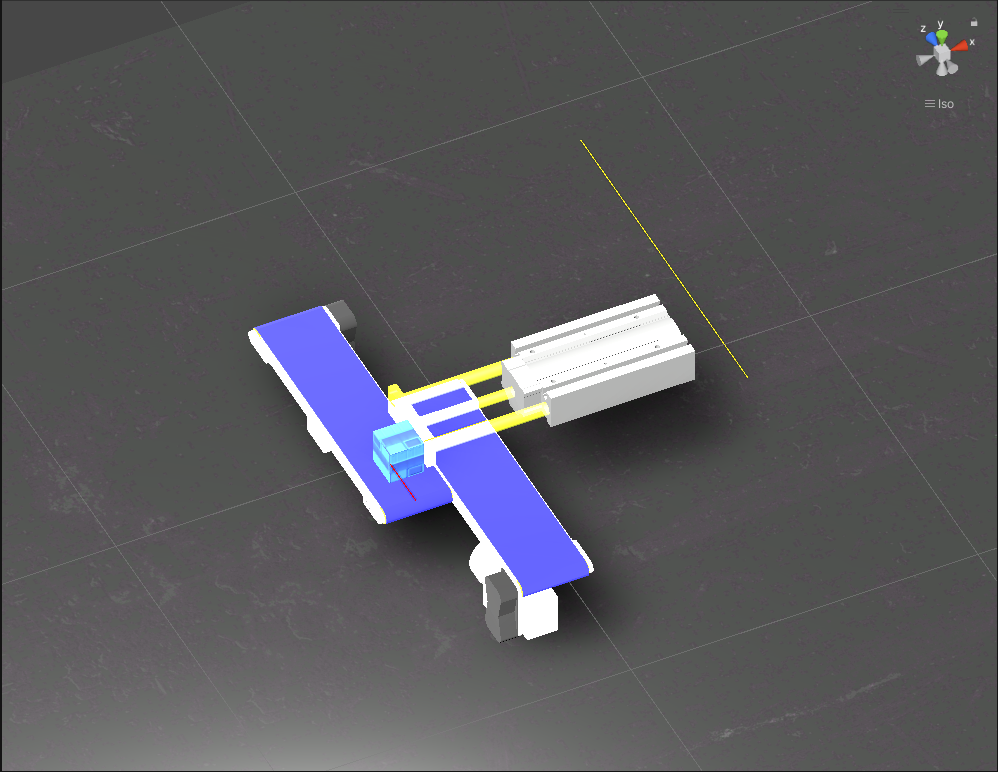
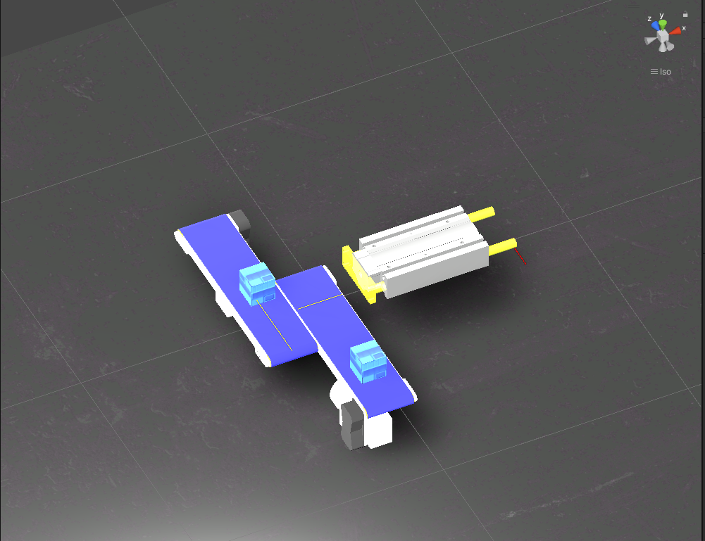

"# Object Sorting" 

Object sorting:
## Scene Setup:
- **Components**:
  - 1 Plunger
  - 2 Conveyors
- **Signals**:
  - BackwardFinish (BF)
  - CanDetected (CD)
  - ForwardFinish (FF)

## Aim: To push the boxes from one conveyor onto another

## Procedure: 
1. **Signal Placement**:
   - **BackwardFinish (BF)**: Positioned at the back of the plunger.
   - **CanDetected (CD)**: Positioned at the plunger face and on top of conveyor one.
   - **ForwardFinish (FF)**: Positioned on conveyor two.  
    The signals turn red when actvated and remain yellow when not activated

2. **Initial State**:
   - A box is placed on the first conveyor.
   - The BF signal is activated, triggering the first conveyor to move.

3. **Box Movement**:
   - The box moves along with the first conveyor.
   - When the box reaches the point in front of the plunger face, the CD signal is triggered.
   - This sends a signal to the plunger to move forward and stops the conveyor movement.

4. **Plunger Action**:
   - The forward movement of the plunger pushes the box onto the second conveyor.
   - The FF signal detects the box on the second conveyor and sends a signal to the plunger to move backward, activating the second conveyor's movement.

5. **Plunger Reset**:
   - The plunger moves backward and triggers the BF signal, activating the movement of the first conveyor.

Refer the link to see the simlution of the above scene: https://www.youtube.com/watch?v=JlNDoXkk2YA

