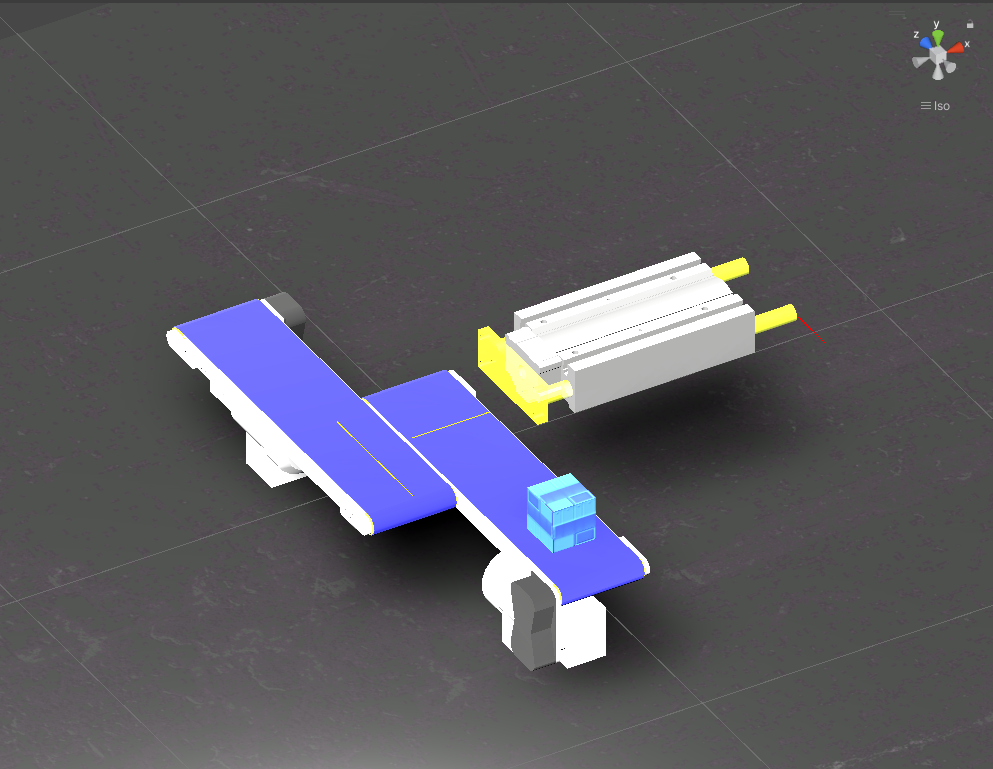
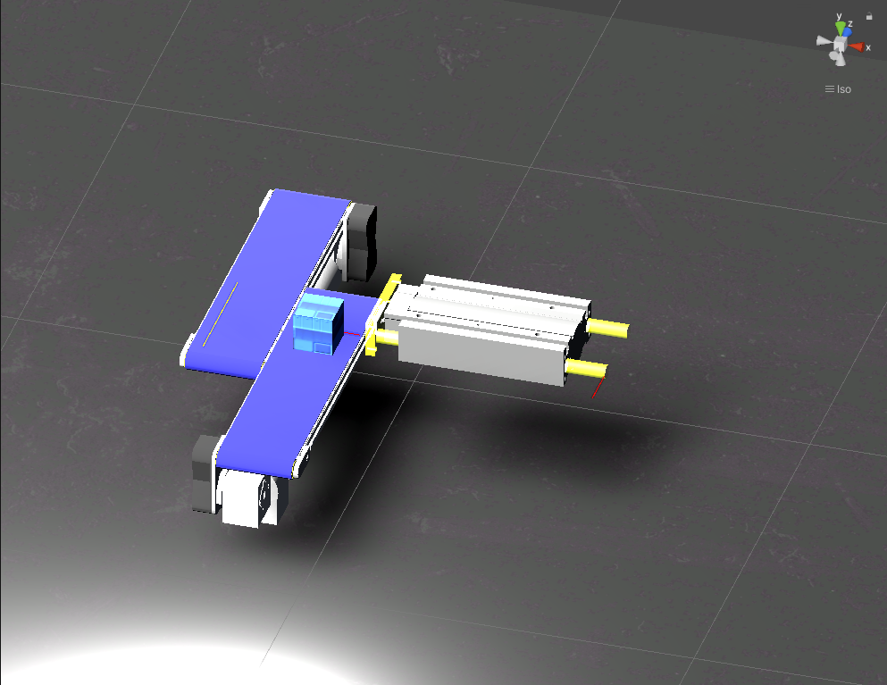
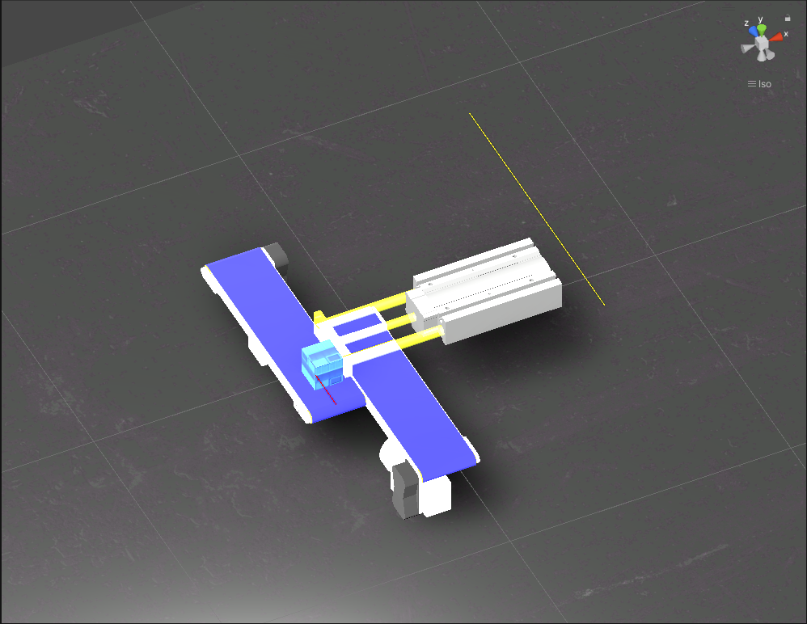
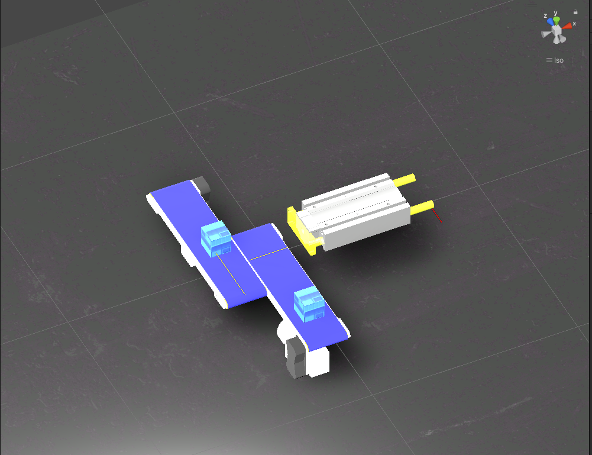
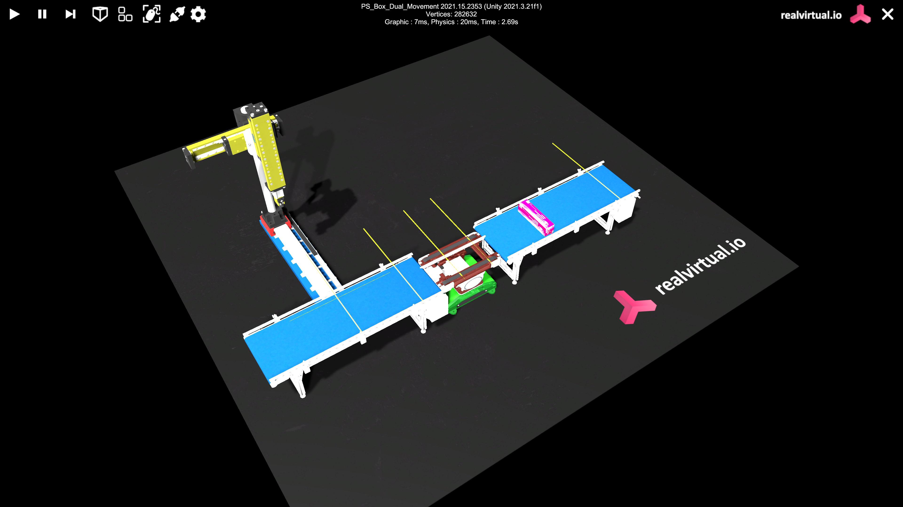
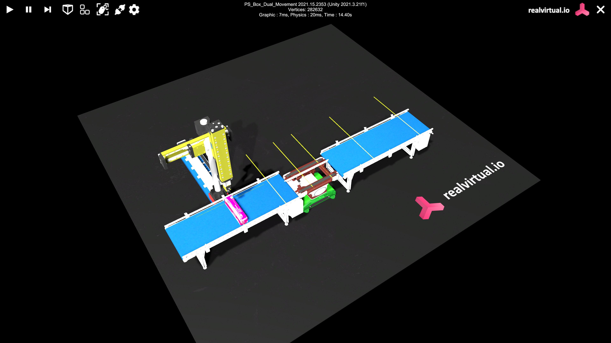
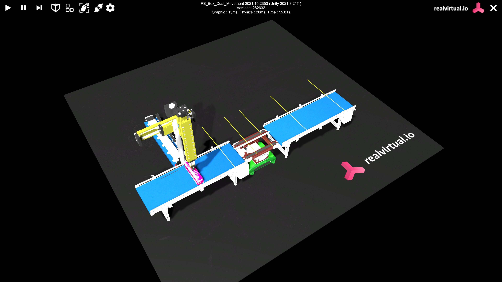
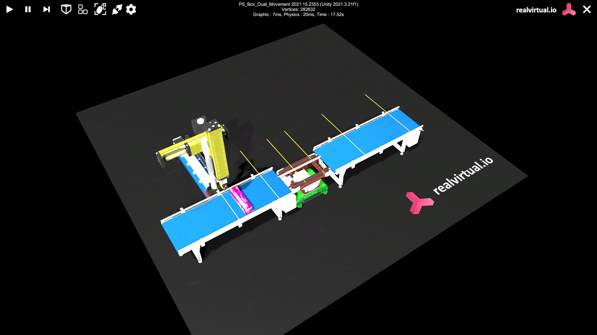
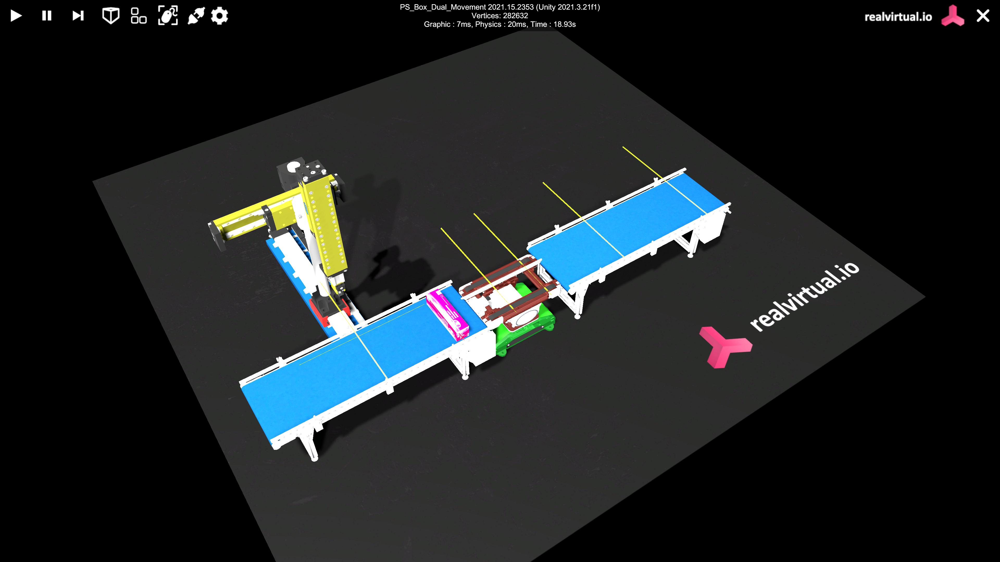
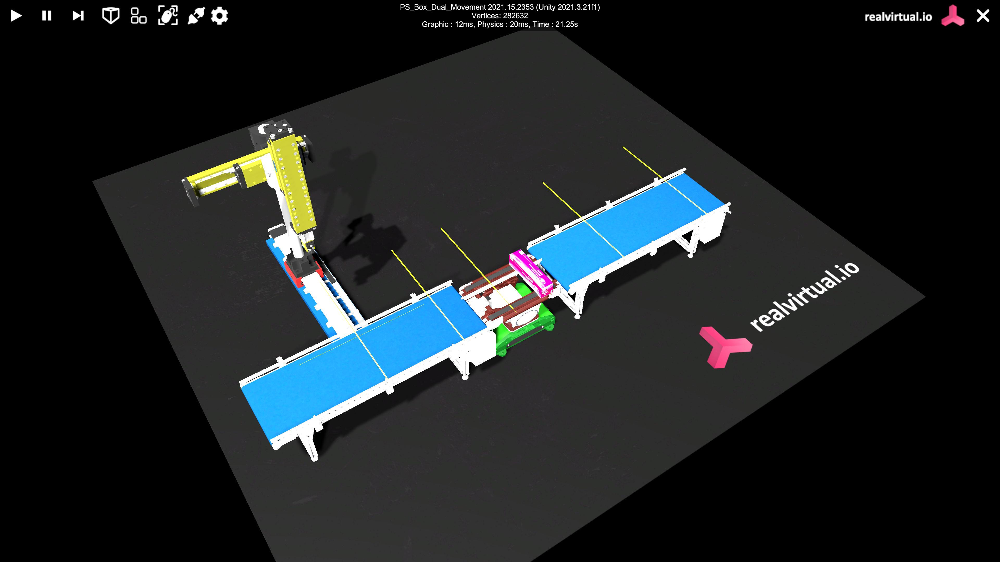

"# RealVirtualIO" 
"# RealVirtualIO" 
This Project aims to use Real Virtual IO (RVIO)SOftware platform powered by Unity 3D
I have developed different secenarios to levergae the RVIO platform.

Scenario 1:
Object sorting:
scene setup:
1 plunger and 2 conveyor
3 signals: BackwardFininsh(BF), CanDetected(CD) and ForwardFinish(FF)

Aim: To push the boxes from one conveyor onto another

PRocedure: 
The signals are placed 3 positions. One at the back of the plunger. Second, at the plunger face and on top of conveyor one. Third on the conveyor 2. The signals turn red when actvated and remain yellow when not activated

At the start state. the box is placed on the 1st conveyor and also the BW signal is activated. This trigegrs 1st conveyor to move

The box on the conveyor also moves alongwith the conveyor. When the box reaches the point infront of the Plungerface, signal CD is triggerd. This sends the signal to the plunger to move forward and stops the conveyor movement. The forward movement of the plunger pushes the box onto the 2nd conveyor.

The signal FF detects the Box on the 2nd conveyor and sends the singal to the plunger to move backward and activated the 2nd conveyor movement.

The plunger moves backward and triggers the BF signal activate the movement of the conveyor 1

Scenario 2:

scene setup:
2 conveyors, 1 divertor, 1 gantry crane, 1 liner axis floor and a Box
This setup also has 7 sensors and each sensor is associated with a signal as an interface connection

Aim: To replicate the production line set up in the Automation Lab

Procedure:
The Digital replica of the prodution line is setup to mimic the its working and functionalities.
Each conveyor is equipped with 2 sensors at each end and a sensor is placed at the end of the linear axis floor

The box is placed on 'conveyor1(C1)' such that it activates the sensor1. This sensor triggers the signal 'StartC1' starting the forward movement of the 1st conveyor. THe box moves forward and activates 'Sensor2'. 
'Sensor2' triggers the signal 'StartD' which starts the forward mnovement of divertor belts.

THe Box moves forward on to the Divertor. When the box activates the 'sensor3', it triggers 'StopC1' to stop 'C1' movement and start the forward movement of 'conveyor2'

The Box moves onto 'conveyor2(C2)' and activates 'Sensor4'. This makes the 'Gantry Crane(GC)' to move forward bz activating the 'StartCrane' signal. 

The 'GC' moves forward towards the 'C2' and activates the 'sensor6'. This sensor then triggers the downward motion of the Schunk through 'CraneDown' signal.

After the downward movement is finished, 'CraneFinish' signal is triggered through 'SchunkSensor' making the Schunk go upwards.

The end of upward motion triggers 'Craneupfinish' signal and starts the 'C2' in the reverse direction

The movement of the Box, deactivates the 'sensor4' triggering the 'StartCrane' again to move back the 'GC' to the home position.

Simulaneously, the Box also activates the 'Sensor5' which sned the signal 'Rstart_D' signal to move the divertor belts in the reverse direction.

Once the Box reachs the Divertor, signal 'Rstart_C1' triggers the movement of 'C1' through Sensor7
